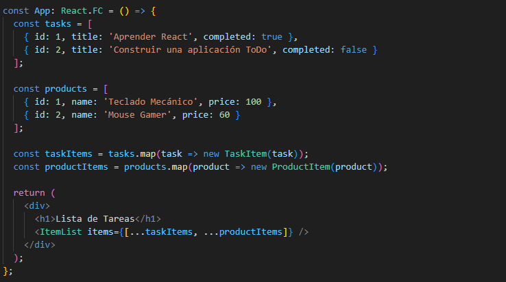

# OPEN CLOSE Principle

- para este ejemplo de principio de abierto y cerrado tomamos el mismo ejemplo del (anti-patron)  que es un "TODO"  el cual  
recibe un arreglo.  

```js
  const tasks = [
    { id: 1, title: 'Aprender React', completed: true },
    { id: 2, title: 'Construir una aplicación ToDo', completed: false }
  ];
```

 

- Como podemos notar ya no solo esta acoplado a recibir  una lista de tareas si no que tambien   recibimos una lista de  productos 

- Al aplicar el OCP y desacoplar el componente ItemList de los tipos específicos de datos, se aumenta la reutilización y la flexibilidad del componente. Este enfoque permite que ItemList maneje diversos tipos de elementos sin necesidad de ser modificado, lo que facilita su mantenimiento y extensión en el futuro.


