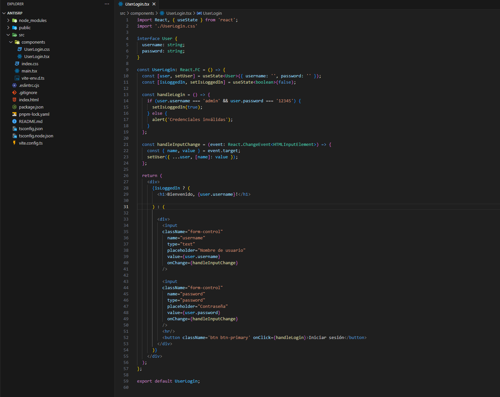

AntiSRP

​

Descripción: 

En este caso podemos notar que la lógica está mezclada, es decir, la lógica de presentación está con la lógica de autentificación.

# Mezcla de Lógica de Negocio y Presentación

El componente UserLogin maneja tanto la lógica de negocio (autenticación del usuario) como la presentación de la interfaz de usuario (UI). Según el SRP, un componente o clase debe tener una sola razón para cambiar. En este caso, cambios en la lógica de autenticación o en la presentación de la UI requerirían modificaciones en el mismo componente.

- **Contras**: La mezcla de lógica de negocio con la lógica de presentación en un solo componente dificulta la reutilización, las pruebas y el mantenimiento del código.
Difícil de Mantener y Escalar
A medida que la aplicación crece, este componente podría inflarse con más funcionalidades, como manejo de errores, recuperación de contraseña, y registro de usuarios, lo que lo haría más complejo y difícil de mantener.

- **Contras**: Un componente sobrecargado de responsabilidades se vuelve más propenso a errores y más difícil de entender y modificar, especialmente para nuevos desarrolladores que trabajen en el código.
Pruebas Complejas
Probar este componente sería más complicado debido a la combinación de lógica de autenticación y UI. Las pruebas unitarias ideales se centran en un aspecto a la vez, pero este componente requeriría mockear estados y comportamientos para probar la lógica de autenticación y la renderización de la UI simultáneamente.

- **Contras**: La estrecha integración de diferentes responsabilidades complica las pruebas unitarias y puede llevar a pruebas menos efectivas y más propensas a errores.
Dificultad para Reutilizar
La lógica de autenticación está directamente acoplada a este componente de UI, lo que dificulta su reutilización en otros contextos o componentes de la aplicación sin replicar la lógica de UI.

- **Contras**: La falta de modularidad y el acoplamiento estrecho limitan la reutilizació