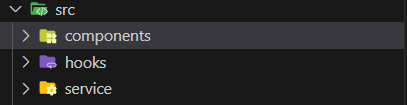
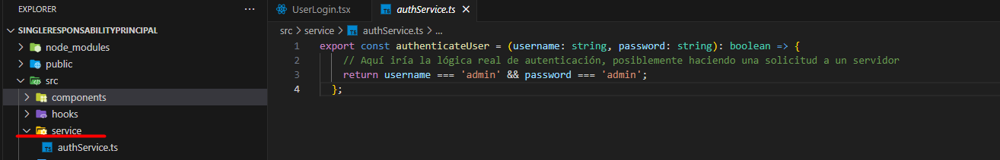
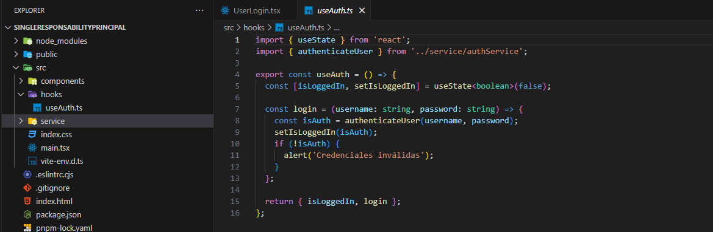
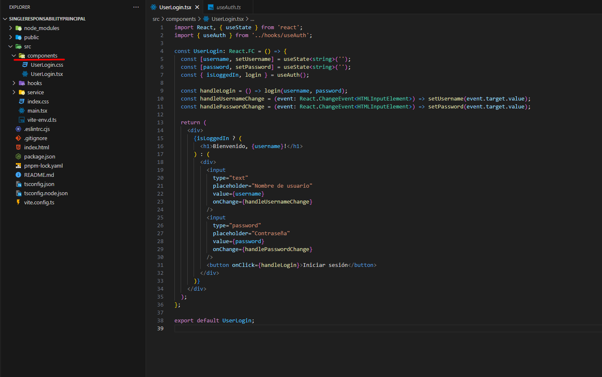

Aplicando el SRP:

Aplicando el concepto de SRP se organizó de la siguiente forma.

​

se creó aparte de mi archivo o carpeta, componentes, un hook y un servicio, esto para poder hacer más comprensible el cómo se divide mi componente

Service:

​

Dentro de mi service tenemos ya separada la lógica de autenticación del usuario, "por el momento retornamos el usuario y el password quemado, ya que no se cuenta con una solicitud al back"

Hook:

tenemos un Hook el cual se va a encargar de estar pendiente del estado de mis credenciales y retornar true o false dependiendo del valor ingresado en los inputs del login

Components:

​

Por último, en component UserLogin ya es más entendible porque delegamos al hook y a la carpeta, service parte de la lógica que hacía que nuestro componente se volviera más difícil de interpretar y donde simplemente estamos atentos a los cambios de estado que sufren nuestros inputs
